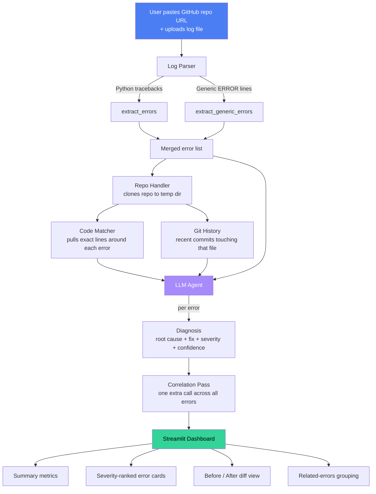

# 🩺 RepoDoctor

**AI-powered repository debugging.** Paste a GitHub repo and a log file — RepoDoctor traces each error back to the actual line of code, explains what went wrong, and suggests a fix.

**Live demo:** [repodoctor.streamlit.app](https://repodoctor.streamlit.app/)
**Video walkthrough:** [add your demo video link here]

Built for the [Pixel Forge AI Hackathon](https://pixel-forge-ai-hackathon-08.devpost.com/).

---

## The problem

Debugging is slow. A stack trace tells you *where* something broke, but not *why* — and generic AI chatbots can't see your actual codebase, so their answers are guesses. RepoDoctor closes that gap: it clones your real repository, pulls the exact code around the failing line, checks recent git history for context, and only then asks an LLM to diagnose it — grounded in your real code, not assumptions.

## How it works



Everything runs as a **single Streamlit process** — no separate backend server. The pipeline logic lives in `backend/`, and `frontend/app.py` calls those functions directly, which is what makes this deployable on Streamlit Community Cloud with zero extra infrastructure.

## Features

- **Traceback + generic log parsing** — handles Python tracebacks and plain `ERROR:` / `CRITICAL:` log lines in the same file, including fully-qualified error types like `sqlalchemy.exc.OperationalError`
- **Real code context** — clones the actual repo and pulls the exact lines around each error, not a guess
- **Git history awareness** — checks recent commits on the affected file and factors that into the diagnosis
- **Severity ranking** — every error is scored critical / high / medium / low, with filtering in the UI
- **Multi-error correlation** — a second pass looks across *all* diagnosed errors to spot ones sharing a root cause
- **Honest confidence signaling** — if the source file can't be located, RepoDoctor says so explicitly instead of guessing silently
- **Before/after diff suggestions** — each error gets a proposed one-line fix, shown as a diff
- **Clean, dark, dashboard-style UI** — built entirely in native Streamlit + custom CSS, no separate frontend framework

## Tested on a real, unfamiliar repo

RepoDoctor was validated against a completely separate project it had never seen before — a FastAPI + PostgreSQL log ingestion service. Given only a `sqlalchemy.exc.OperationalError` traceback, it:

- correctly parsed the dotted, fully-qualified error type
- cloned the real repo and pulled the actual surrounding code (`ingestion/main.py`)
- referenced real recent commits touching the database config
- correctly rated the issue **CRITICAL**
- suggested a specific, accurate fix (verify `DATABASE_URL`, confirm the DB server is reachable)

This confirms the diagnosis is grounded in the real codebase, not a generic guess — it generalizes beyond its own source.

## Tech stack

| Layer | Tool |
|---|---|
| UI | Streamlit + custom CSS |
| Log parsing | Python `re` |
| Repo access | GitPython |
| AI | OpenAI (`gpt-4o-mini`) |
| Hosting | Streamlit Community Cloud |

## Project structure

    RepoDoctor/
    ├── backend/
    │   ├── __init__.py
    │   ├── log_parser.py       # traceback + generic error extraction
    │   ├── repo_handler.py     # clone/cleanup, git history lookup
    │   ├── code_matcher.py     # pulls code context around a line
    │   └── llm_agent.py        # diagnosis + correlation prompts
    ├── frontend/
    │   └── app.py              # Streamlit UI, calls backend functions directly
    ├── requirements.txt
    ├── LICENSE
    └── README.md

**Key modules:**

- `log_parser.py` — parses raw log text into structured errors, using two strategies: full Python tracebacks (`extract_errors`) and single-line `ERROR`/`CRITICAL`/`FATAL` messages (`extract_generic_errors`)
- `repo_handler.py` — clones the target GitHub repo into a temp directory, cleans it up afterward, and pulls recent git commit history for a given file
- `code_matcher.py` — given a file path and line number, extracts the surrounding code with the failing line clearly marked
- `llm_agent.py` — builds the diagnosis prompt (error + code + git history) and the cross-error correlation prompt, calls OpenAI, and parses the structured JSON response
- `frontend/app.py` — the entire UI: input form, loading states, metrics dashboard, severity-ranked error cards, and diff view, all calling the backend modules directly in-process

## Run it locally

```bash
git clone https://github.com/KayTheCoder-101/RepoDoctor.git
cd RepoDoctor
python3 -m venv venv
source venv/bin/activate
pip install -r requirements.txt

export OPENAI_API_KEY="your-key-here"

streamlit run frontend/app.py
```

Then open `http://localhost:8501`, paste a public GitHub repo URL, upload a `.log` or `.txt` file containing a Python traceback or error lines, and click **Diagnose Repository**.

## Known limitations

- Currently supports Python tracebacks and single-line `ERROR`/`CRITICAL`/`FATAL` logs; other language stack trace formats aren't parsed yet
- Code matching works on public repos accessible via `git clone`; private repos aren't currently supported
- The "before/after" diff is a suggested single-line fix, not an applied patch — it's meant to guide a manual fix, not auto-modify your repo

## License

MIT — see [LICENSE](./LICENSE).
